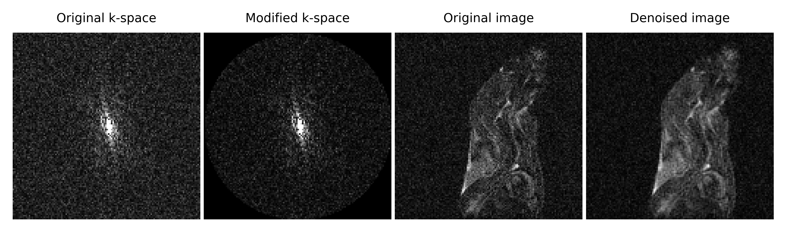

# k-space_wght_msk_for_MRI_denoising
k-space weighting and masking for denoising of MRI image without blurring or losing contrast, as well as for brightening of the objects in the image with simultaneous noise reduction (on the example of Agilent FID data).

## The repository contains:
1. Python script wght_msk_kspace.py.
2. [COMMING SOON] PDF file presenting:
- short introduction to the topic,
- how the code works,
- sample results.
3. Sample FID data in the mems_20190406_02.fid folder.
4. Sample results illustration in Figure1.png and Figure2.png.

## Literature reference (for the sample data)
Beata Wereszczyńska, *Alcohol-fixed specimens for high-contrast post-mortem MRI*, Forensic Imaging, Volume 25, 2021, 200449, ISSN 2666-2256, https://doi.org/10.1016/j.fri.2021.200449. (https://www.sciencedirect.com/science/article/pii/S2666225621000208)

## License
The software is licensed under the MIT license. The non-software content of this project is licensed under the Creative Commons Attribution 4.0 International license. See the LICENSE file for license rights and limitations.
